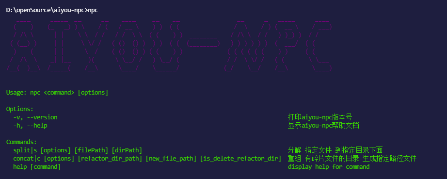

<p align="center">
    
</p>

# aiyou-npc（超轻量 文件分割加密、重组工具）- 哎呦系列


- [🔥 功能列表](##功能列表)
- [✨ 使用介绍](#使用介绍)
- [🚀 快速上手](#快速上手)
- [📚 开发文档](#开发文档)
- [📞 社区交流](#社区交流)

---

## aiyou-npc 是什么鬼？

aiyou-npc 是**哎呦系列**中，用于在受保护的机器中拷贝文件，管你几重加密，只要能安装我，统统拷贝下来，谁用谁爽[狗头保命]，交互式的操作，非常的简单。

- ✂️ 轻量：`ES6` 面向对象 代码编写，有良好的`扩展性，后续有空会添加`jest`单元测试以及`typescript`支持。
- ⚡ 易用：交互式操作，可作为命令行工具来全局使用，也可作为第三方依赖包使用。
- 💉 强大：能够让你从受保护的机器中拷贝文件哟，不用再里面写一遍，外面再重新敲一遍。特别是大文件嘞。
- ⚙️️ 简单: 只有 3 个 api，分别是 split、concat、eat，命令行工具更简单，只有两个命令。

| nodejs | npm   | size   |
| ------ | ----- | ------ |
| > 12.0  | > 6.0 | 忽略不计 |

## 🔥 功能列表

aiyou-npc 程序，可以同时运行在 windows 和类 unux 的电脑中：

| api                                   | 效果                                                               |
| ------------------------------------- | ------------------------------------------------------------------ |
| npc                              | 打开 aiyou-npc 程序的帮助文档                             |
| npc split 指定文件 到指定目录下面      | 分解 指定文件 到指定目录下面                     |
| npc concat 有碎片文件的目录 生成指定路径文件 [重组完成后是否删除碎片文件目录]    | 重组 有碎片文件的目录 生成指定路径文件       |
| ...                                   | 后续功能待优化                                                     |

---

## ✨ 使用介绍

### ⚔️ 安装指南

全局安装，作为命令行工具来使用：

```bash
    npm install -g aiyou-npc
```

---

作为第三方依赖安装：

```bash
    npm install aiyou-npc
```

### 📈 使用方法

全局使用（全局安装后的使用方式），在命令行工具中逐行输入以下命令：

```bash
    cd target-directory
    npc
```

---

局部使用（作为第三方依赖包来使用），在 node 环境下的 js 文件中复制以下代码进行粘贴：

```javascript
const { eat, split, concat} = require ('aiyou-npc');

// 看，非常简单
eat(refactorDir, runing, ending, runingError) // 删除操作
split(fileName, saveDir, runing, ending, runingError) // 分割操作
concat(refactorDir, newFilePath, runing, ending, runingError) // 重组操作
```

---

### 😎 浮夸的效果



---

## 🚀 快速上手

**安装**->**使用**

## 📚 开发文档

aiyou-npc 是最简单，易用的用于在受保护的机器中拷贝文件。基于 aiyou-no-repeat。

## 代码仓库

[github 链接](https://github.com/aiyoudiao/aiyou-npc)

## 📞 社区交流

aiyou-npc 是**哎呦系列**中一员，之后还会有其它的成员陆续上来。

有问题可以在github的issue中提哟，感兴趣也可以加微信交流：


### 感谢以下开源工具

- commander：node.js 的命令解决方案
- chalk：这是一个能给你的 log 染色的库,让你的代码靓起来
- child_process：子进程工具
- inquirer：一个非常好看的交互式命令行用户界面,用它来定制你的 CLI 吧 
- ora：优雅的转圈圈,让你的等待不再煎熬～
- figlet：一个非常有意思的绘logo图的库
- boxen：给你的logo “画地为牢”
